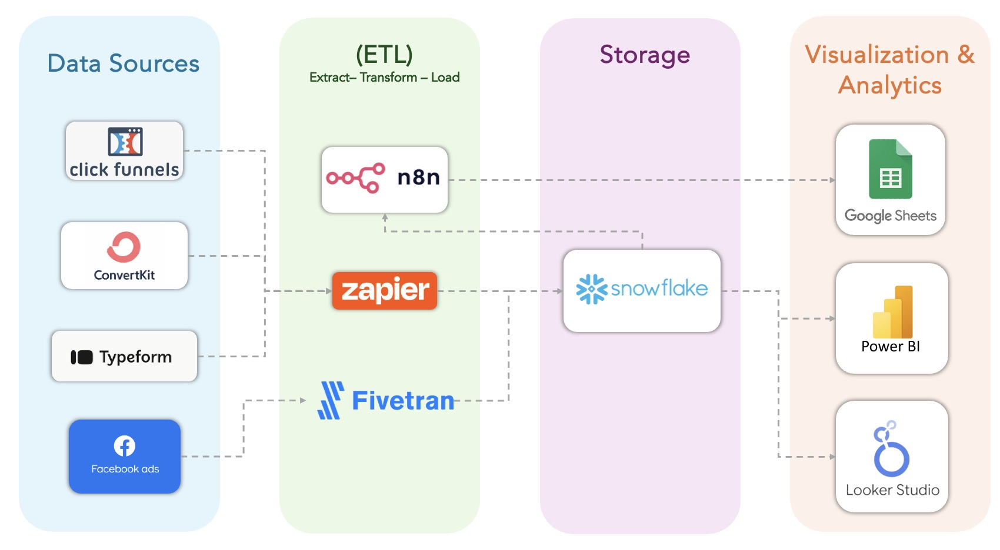
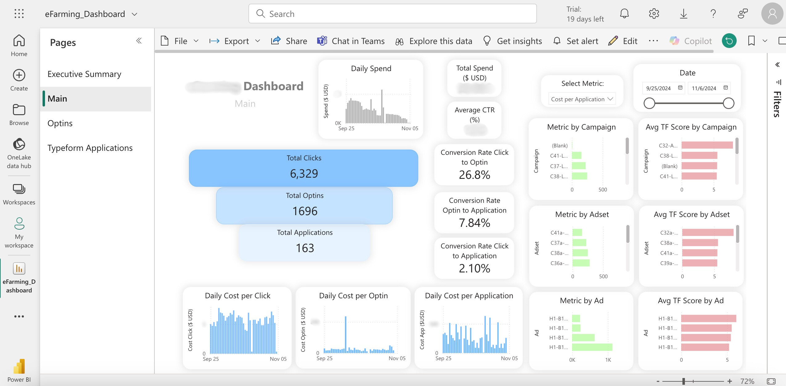
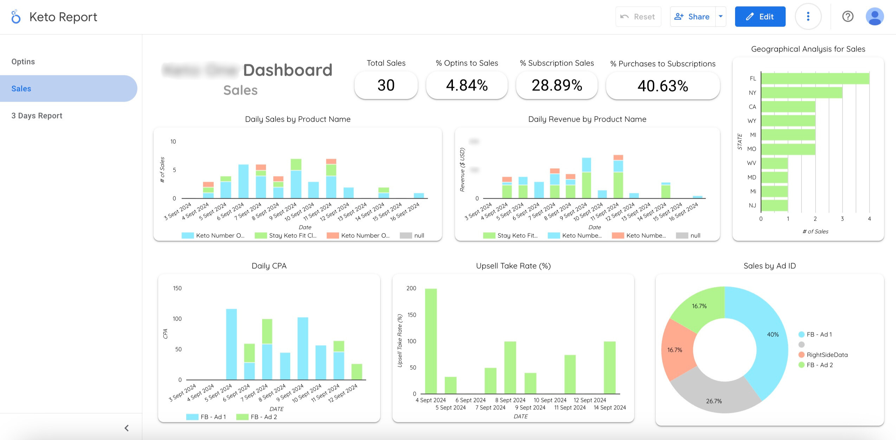
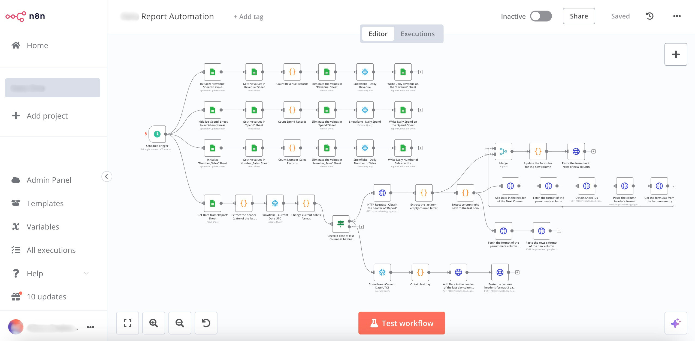
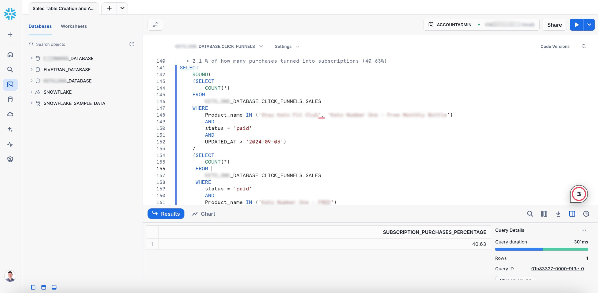
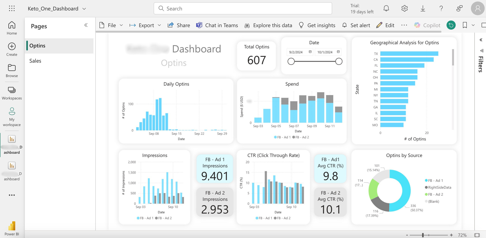
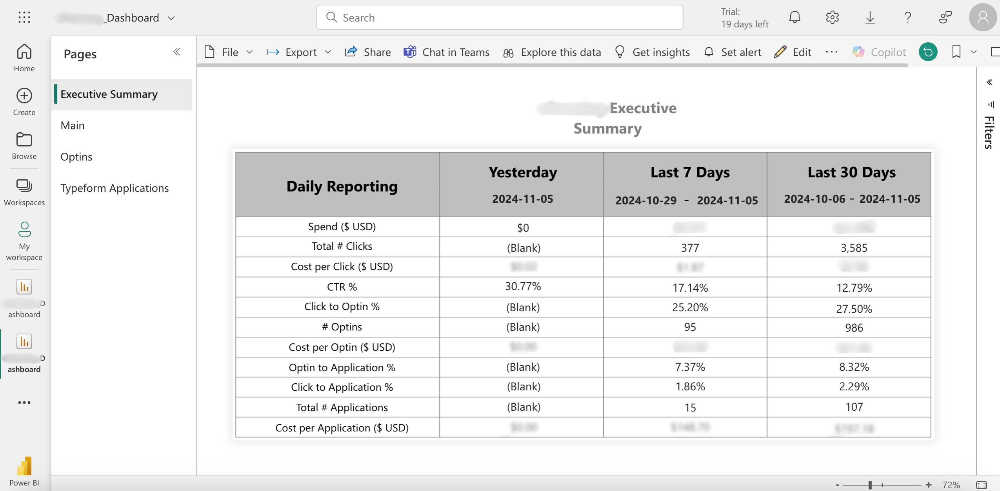

# <p align="center">   </p>
# <p align="center"> Marketing Analytics: A real-case study </p>

## Introduction & Context

This repository showcases my recent placement as a **Business Analytics Intern** at **Limitless Marketing** in Canada. **Limitless Marketing** is a digital marketing agency specializing in delivering comprehensive solutions to clients, empowering them to focus on refining and expanding their products and services while entrusting their marketing to industry experts.

One of the major challenges facing marketing agencies today is managing vast amounts of data from diverse sources, often without a consolidated system for analytics and data-driven decision-making. To address this, my primary objective was to develop an **end-to-end analytics solution**. This solution included building a centralized data warehouse as a single source of truth, implementing efficient ETL pipelines, and creating real-time, interactive dashboards. It was an exciting and rewarding project that I’m eager to share in detail below.

## Objectives

1.	**Develop a Centralized Data Warehouse:** Build a data warehouse from scratch to consolidate all campaign data into a single platform. After evaluating several options, including Azure Synapse and Google Cloud Platform, Snowflake was selected as the optimal solution for its scalability, performance, and ease of integration.
2.	**Automate Data Ingestion Workflows:** Design and implement automated workflows using Zapier, n8n, and Fivetran to integrate data from sources like ClickFunnels, ConvertKit, Typeform, and Facebook Ads.
3.	**Enable Real-Time Analytics:** Prepare data for analytics by building dashboards that provide real-time insights for clients.
4.	**Support Data-Driven Decision Making:** Help clients ask relevant questions and improve decision-making processes through actionable insights.
5.	**Drive Business Growth:** Empower clients to make informed decisions that enhance campaign effectiveness and increase revenue.

## Limitations & Constraints

1.	**Lack of an Established Data Department:**
At the start of my placement, one of the biggest challenges was the absence of any data management infrastructure within the company, meaning I had to build everything from scratch. However, I viewed this as a valuable opportunity for growth and learning. This mindset allowed me to explore different software tools and solutions freely, and I’m proud to say that I not only met but exceeded expectations with my deliverables.
2.	**Learning Automated Workflows:**
Developing automated workflows was entirely new to me, as my previous experience involved working with static datasets. In this role, I challenged myself to learn tools like Zapier, n8n, and Fivetran to build ETL pipelines that automatically ingest data into our new Snowflake database. At times, predefined nodes weren’t available to integrate certain platforms, requiring me to write custom Python scripts within the automation tools to retrieve data through APIs.

## Tech Stack & Data Architecture



The following diagram illustrates the data flow and the software used at each stage (Company A and Company B are not disclosed due to confidentiality agreements).

1. **Data Sources** 
    * **Click Funnels:** Captures new contact information (opt-ins) and sales data for Company A.
    * **ConvertKit:** Catches the new contacts' information (Optins) for Company B.
    * **Typeform:** Collects responses from surveys completed by new contacts at Company B. These responses help classify clients and identify potential buyers.
    * **Facebook Ads:** This platform manages campaigns, ad sets, and individual ads. It also provides spend data and key performance metrics for advertising efforts. Is is used for Companies A and B. 

2. **ETL (Extract - Transform - Load)** 
    * **Zapier:** Data from Company A and Company B is collected using webhooks and API calls. Zapier handles initial transformations before sending the data to its respective database in Snowflake.
    * **Fivetran:** Fivetran extracts data from multiple sources and uses a predefined schema to collect and transfer Facebook Ads data directly to the Snowflake database.
    * **n8n:** n8n retrieves data from the Snowflake database and automates report generation in Google Sheets, a platform commonly used by stakeholders to monitor their KPIs.

3. **Storage** 
    * **Snowflake:** Due to time constraints, platforms like Azure Synapse and Google Cloud Platform were not selected for the data warehouse, despite offering advantages such as more robust workflow capabilities within their own environments. Snowflake was chosen instead for its ease of deployment and user-friendliness. In future projects, it may be worthwhile to conduct further research into these alternatives. 

4. **Visualization & Analytics** 
    * **Google Sheets:** It was the visualization platform used by stakeholders prior I came other alternatives such as PowerBI and Looker Studio. 
    * **Power BI:** It was used to build interactive dashboards that allow clients to take better decisions. Power BI Desktop was used to create the semantic model and the dashboard. Power BI Server was used to share the dashboards between the members of Limitless Marketing and the clients. 
    * **Looker Studio:** A real-time dashboard was also created in Looker Studio to check which platform offers better capabilities, finding that Power BI has more options to relate the tables and obtain better visualization through complex joins.

## Specific Technical Requirements

The placement required advance knowledge in SQL, Python, Power BI, Looker Studio, and n8n. Here are the reasons:

1.	**SQL:** SQL is the language used to work with most of the databases. This is also the case for Snowflake. It was needed to run complex queries such as CTEs, Subqueries and Window Function to obtain answers to business questions such as:

    * What is the % of optins who become a sale?
    * What is the % of sales that are subscription purchases versus one-time purchases?
    * % of how many purchases turned into subscriptions.
    * How many successful purchases from each ad?
    * How many sales from “RightSideData” versus “Facebook”?
    * Between these campaigns which campaign made the most sales?
    * Between these ads which one has the lowest cost per purchase?

    For example, to solve the last question I had to run this query: 

```sql
WITH 
    Total_Spend_per_AD_ID AS
    (
    SELECT 
        AD_ID,
        SUM(SPEND) AS Total_Spend
    FROM
        FIVETRAN_DATABASE.FACEBOOK_ADS.basic_ad_action_values
    WHERE 
        AD_NAME LIKE '%Company A Sales - Clickfunnels and WickedReports%'
    GROUP BY
        AD_ID
    ),
    Number_of_Purchases_per_AD_ID AS
    (
    SELECT
        sub.utm_content AS AD_ID,
        COUNT(cf_uvid) AS Number_of_Sales
    FROM (
        SELECT
            DISTINCT
                Optins.utm_content,
                Optins.cf_uvid
        FROM
            K_ONE_DATABASE.CLICK_FUNNELS.OPTINS AS Optins
        JOIN
            K_ONE_DATABASE.CLICK_FUNNELS.SALES AS Sales
        ON
            Optins.cf_uvid = Sales.cf_uvid
        WHERE
            Optins.utm_content IN ('120211*****2990168', '120211*****6790168')
            AND
            Sales.Status = 'paid'
            AND
            Sales.UPDATED_AT > '2024-09-03'
        ORDER BY
            Optins.utm_content
        ) AS sub
    GROUP BY
        sub.utm_content
    )
    SELECT 
        Total_Spend_per_AD_ID.AD_ID,
        ROUND(Total_Spend_per_AD_ID.Total_Spend/ Number_of_Purchases_per_AD_ID.Number_of_Sales, 2)
        AS Cost_per_purchase
    FROM
        Total_Spend_per_AD_ID
    JOIN
        Number_of_Purchases_per_AD_ID
    ON
        Total_Spend_per_AD_ID.AD_ID = Number_of_Purchases_per_AD_ID.AD_ID
;
```

2.	**Python:** It was used to transform data within Zapier or n8n, as those platforms allow running code for non-predefined nodes.

    For example, here is one script to convert the data gathered from Click Funnels using Zapier into a format that can be exported to Snowflake.

```python
def convert_timestamp_format(timestamp):
    # Remove the 'T' and the 'Z' from the original format
    date_time = timestamp.replace('T', ' ').replace('Z', '')
    # Return the result in the desired format
    return date_time

created_at_converted = convert_timestamp_format(input_data.get('created_at', 'null'))

return {
    'id': input_data.get('id', 'null'),
    'page_id': input_data.get('page_id', 'null'),
    'first_name': input_data.get('first_name', 'null'),
    'last_name': input_data.get('last_name', 'null'),
    'address': input_data.get('address', 'null'),
    'city': input_data.get('city', 'null'),
    'state': input_data.get('state', 'null'),
    'country': input_data.get('country', 'null'),
    'zip': input_data.get('zip', 'null'),
    'email': input_data.get('email', 'null'),
    'phone': input_data.get('phone', 'null'),
    'webinar_ext': input_data.get('webinar_ext', 'null'),
    'created_at': created_at_converted,
    'ip': input_data.get('ip', 'null'),
    'funnel_id': input_data.get('funnel_id', 'null'),
    'funnel_step_id': input_data.get('funnel_step_id', 'null'),
    'cf_uvid': input_data.get('cf_uvid', 'null'),
    'age': input_data.get('age', 'null'),
    'gender': input_data.get('gender', 'null'),
    'utm_source': input_data.get('utm_source', 'null'),
    'utm_medium': input_data.get('utm_medium', 'null'),
    'utm_campaign': input_data.get('utm_campaign', 'null'),
    'utm_term': input_data.get('utm_term', 'null'),
    'utm_content': input_data.get('utm_content', 'null'),
    'purchase_product_ids': input_data.get('purchase_product_ids', 'null'),
    'answer_1': input_data.get('answer_1', 'null'),
    'answer_2': input_data.get('answer_2', 'null'),
    'answer_3': input_data.get('answer_3', 'null'),
    'survey_outcome': input_data.get('survey_outcome', 'null'),
    'survey_results': input_data.get('survey_results', 'null'),
    'event': input_data.get('event', 'null'),
    'contact_id': input_data.get('contact_id', 'null')
}
```

3.	**Power BI:** It was used to build interactive dashboards that allow our clients to take better decisions. Power BI Desktop was used to create the semantic model and the dashboard. Power BI Server was used to share the dashboards between the members of Limitless Marketing and the clients.

    For example, this is the view of one of the dashboards in Power BI Desktop:



4.	**Looker Studio:** A real-time dashboard was also created in Looker Studio to check which platform offers better capabilities, finding that Power BI has more options to relate the tables and obtain better visualization through complex joins.

    For example, this is the view of one dashboard designed using Looker Studio:



5.	**n8n Workflow:** An n8n workflow was created to extract data from the Snowflake database, transform it, and automatically update every day a Google Sheets document. This allows stakeholders to easily visualize their KPIs.

    For example, here is one of the workflows designed in n8n:



## Deliverables and Milestones

These are the deliverables given to Limitless Marketing:

1.	**Snowflake Datawarehouse:** Different schemas were created for two main customers: Company A and Company B. Also, another schema was created to ingest the data from Facebook Ads. 


 
2.	**Company A Dashboard in Power BI Server:** This dashboard has two pages. ‘Optins’ was developed to analyze the data related to new contacts, including analysis by source of acquisition (Facebook or RightSide Data), Adset performance, metrics such as CTR and Impressions and geographical analysis. ‘Sales’ was developed to analyze conversion rates, CPA, Revenue and Spend. Also, to analyze upsell take rate, which analyzes the purchases of premium products after a core sale. 




3.	**Company B Dashboard and Executive Summary Table:** Has different pages according to different purposes. ‘Executive Summary’ aims to show metrics in varied time frames: Yesterday, Last 7 Days, Last 30 Days. This allows to check how the campaigns performed through different perspectives and take better decisions. ‘Main’ is the real-time interactive dashboard that analyzes all the funnel numbers into one single page. This is the dashboard shown above.
 


## Perception of the outcomes & satisfaction of the client

This placement gave me the opportunity to work on a project I’ve always wanted to pursue: building a complete data pipeline that ingests data from multiple sources, performs ETL processes, and delivers a real-time, interactive dashboard to generate meaningful insights. I am proud of the results achieved and the solutions developed for Limitless Marketing. Each deliverable was aligned with the client’s requirements, and I effectively combined their business knowledge with my data expertise to create a high-impact dashboard. My supervisor frequently expressed his amazement at the quality of my work and my ability to learn quickly, which allowed him to entrust me with increasing responsibilities throughout the project. I believe Limitless Marketing was highly satisfied with my contributions, and I left the door open for potential future collaborations. Please refer to the [letter of recommendation](PDFs/Juan%20Grisales%20Letter%20Of%20Recommendation%20-%20Limitless%20Marketing.pdf) written by my supervisor.

## Lessons learned

1.	**Building from Scratch Requires Flexibility and Creativity:** Starting without an established data infrastructure can feel daunting, but it offers an opportunity to innovate and explore new solutions. I learned to build and architect a data warehouse in Snowflake, demonstrating resilience and the ability to work autonomously.

2.	**Quick Adaptation to New Tools and Technologies:** Mastering tools like Zapier, n8n, and Fivetran requires a growth mindset and the willingness to learn on the job. Despite limited prior experience with automated workflows, I successfully built ETL pipelines and even wrote custom Python scripts for API integrations.

3.	**Real-World Application of Analytical Skills:** Theory meets practice when you apply advanced SQL queries and analytics tools (e.g., Power BI) to answer complex business questions. I gained deeper insights into digital marketing metrics like opt-in conversion rates, subscription trends, and ad performance.

4.	**The Power of Visualization for Decision-Making:** Interactive dashboards (Power BI, Looker Studio) enable stakeholders to make better data-driven decisions by providing actionable insights. My dashboards empowered clients to assess campaigns and optimize performance, driving business growth.

5.	**Collaboration and Feedback Drive Success:** Working closely with stakeholders and receiving frequent feedback can accelerate learning and improve deliverables. My collaboration with Alborz strengthened the project, blending his business insights with my technical expertise.

6.	**Handling Challenges Through Effective Communication:** Open communication helps overcome challenges such as credential issues or permission roadblocks. Regular meetings with my supervisor helped me stay on track and quickly resolve any blockers.

7.	**Balancing Technical and Business Skills:** A successful analytics project requires both technical proficiency and business acumen. My work not only met technical requirements but also aligned with the client’s business objectives, leading to impactful results.

8.	**Client Satisfaction Leads to Future Opportunities:** Delivering high-quality work and building trust can create opportunities for future collaboration. My supervisor expressed satisfaction with my contributions, leaving the door open for continued partnership.

## Things that could be done differently and the ones that were well done

Due to time constraints, platforms like Azure Synapse and Google Cloud Platform were not selected for the data warehouse, despite offering advantages such as more robust workflow capabilities within their own environments. Snowflake was chosen instead for its ease of deployment and user-friendliness. In future projects, it may be worthwhile to conduct further research into these alternatives. Additionally, consolidating automation efforts, ETL pipelines, and the data warehouse on a single platform could reduce costs by eliminating multiple subscriptions. On the other hand, for future projects, it will be important to develop data protection and governance strategies, along with thorough documentation to ensure future analysts can easily build on the existing infrastructure.

Now, talking about the thing that were well done, I achieved several key successes that contributed to the project’s overall impact. I built a Snowflake data warehouse from scratch, demonstrating strong problem-solving skills and autonomy, which provided Limitless Marketing with a solid foundation for centralized data management and better analytics. I quickly mastered tools like Zapier, n8n, and Fivetran (writing custom Python scripts when needed) showcasing my adaptability and ability to learn new technologies efficiently. The Power BI dashboards I developed offered real-time insights, empowering clients to make data-driven decisions and optimize campaign performance effectively.

I aligned data insights with business goals, helping clients increase revenue and improve campaigns, which demonstrated my ability to deliver meaningful business value. Regular communication with my supervisor ensured smooth collaboration, allowing me to address challenges and refine my work based on continuous feedback. Throughout the project, I took full ownership of my responsibilities, from building the data infrastructure to delivering dashboards and insights, ensuring all deliverables met or exceeded expectations.

## Recommendations 

1.	**Develop a Data Governance Framework:** As the data infrastructure grows, implementing a governance framework will ensure data quality, consistency, and security. Introducing clear policies on data access, documentation, and version control will help future analysts maintain the system and prevent knowledge gaps. Additionally, aligning with data privacy regulations (for example: GDPR, CCPA) will enhance trust and compliance.

2.	**Consolidate Platforms and Workflows:** While using multiple platforms like Zapier, n8n, and Fivetran offered flexibility, consolidating automation tools and ETL pipelines onto a single platform could streamline processes, reduce subscription costs, and simplify maintenance. Future projects should explore unified solutions to enhance operational efficiency.

3.	**Evaluate Long-Term Data Infrastructure Options:** Although Snowflake was an excellent choice for this project due to its ease of use and scalability, future considerations could include platforms like Azure Synapse or Google Cloud Platform for their native integration with other services. Conducting a more comprehensive evaluation of alternatives would ensure that infrastructure choices align with long-term business needs.

4.	**Enhance Documentation and Training:** Comprehensive documentation of the data architecture, ETL workflows, and dashboards will facilitate smooth transitions for future team members. Offering internal training sessions to stakeholders on using analytics tools can also maximize the value derived from dashboards.

5.	**Introduce Advanced Analytics and Predictive Insights:** To further enhance decision-making, future initiatives could incorporate predictive analytics and machine learning models. These advanced techniques could forecast trends, identify potential customer churn, and optimize ad spending in real time, driving greater business impact.

6.	**Build on Automation Success:** The automation achieved in this project was a key milestone. Expanding on this success by automating performance reports, alerts, and campaign recommendations could further improve efficiency and reduce manual tasks for the team.

## Conclusions

This placement at Limitless Marketing was a transformative learning experience that allowed me to build a complete data infrastructure from the ground up. I successfully created a centralized data warehouse in Snowflake, developed automated workflows, and designed real-time dashboards that empowered clients to make data-driven decisions. These achievements not only provided business value to the client but also strengthened my technical and problem-solving skills.

The project presented challenges, such as building without an existing data framework and learning new tools on the go. However, these challenges became opportunities for growth, allowing me to innovate, adapt quickly, and deliver high-quality solutions. I take pride in having aligned my technical work with business goals, creating meaningful outcomes that improved campaign performance and increased revenue for clients.

Additionally I am excited to leverage the skills and experience gained from this project in future endeavors. The knowledge I acquired in data management, automation, and analytics has deepened my expertise and boosted my confidence in handling complex problems independently. The strong collaboration with my supervisor and the satisfaction expressed by Limitless Marketing reinforce my belief in the power of effective communication and stakeholder engagement. This placement has laid a solid foundation for my career in business analytics, and I am grateful for the opportunity to contribute to Limitless Marketing’s success.
